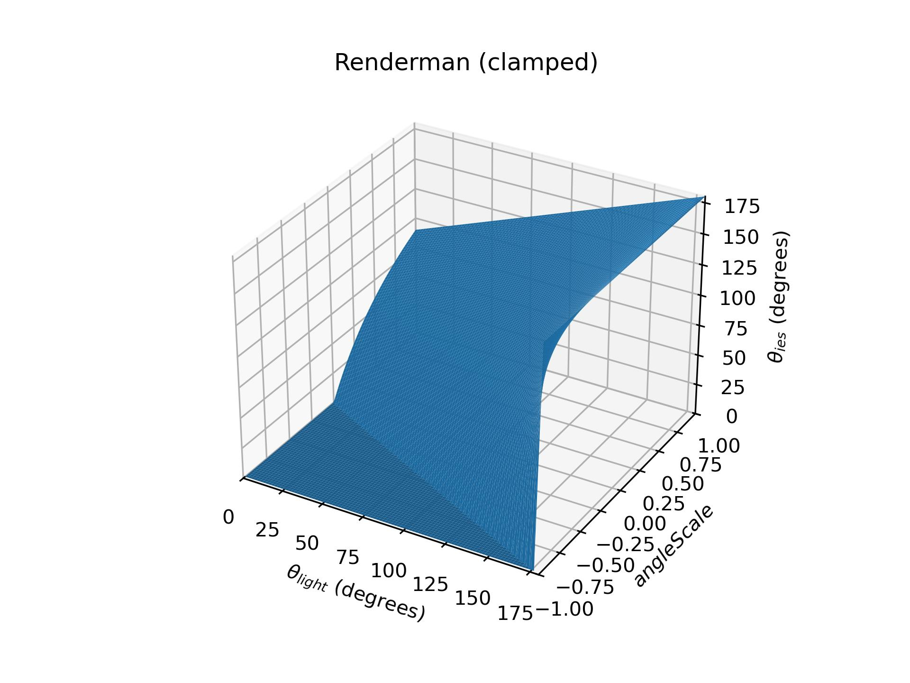
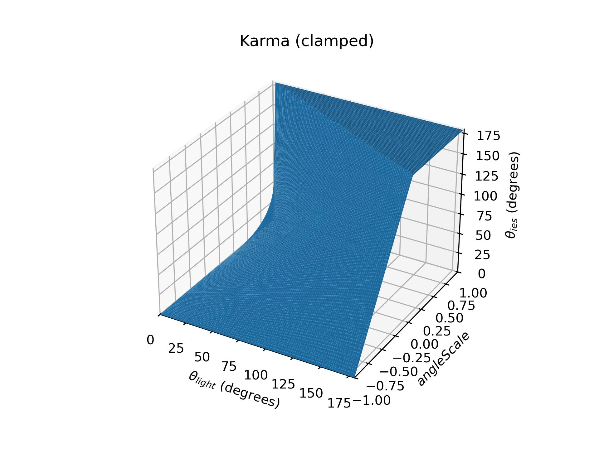

# ies:AngleScale - findings and questions

While working to [explicitly specify
UsdLux](https://github.com/PixarAnimationStudios/OpenUSD/pull/3182), we needed
to determine the formula for applying the [ies:angleScale][ies_angleScale_doc].

The [version we settled on for our initial PR][pr_iesAngleScale_formula] was:

$$ \theta_{ies} = \frac{\theta_{light} - \pi}{1 + angleScale} + \pi $$

This formula was chosen because it matches the behavior of how RenderMan applies
`ies:angleScale`, as the attribute is presumably derived from the [profile scale
attribute in Renderman.][rman_profile_scale_doc].

However, this choice has several drawbacks, so we thought we should share our
findings and solicit advice.

## Visualization

To help visualize the effect of the angleScale, I created a [test .ies
file][ies_test_file] consisting of bands of alternating dark/light horizontal
stripes.  The bottom (verticalAngle=0) is always .25 (gray-black) and the top
(verticalAngle=180) is always .75 (gray-white). (The horizontal angle space is
also divided into quadrants, but we can ignore horizontal-angle differences for
this discussion.)

I then placed a light with this IES profile at the center of a sphere, and
rendered the interior of the sphere, from verticalAngle 0° to 180°, to generate
an output that looks like this with no angleScale applied:

 \
[\[exr\]][ies_test_ref_exr]

More details on exact rendering procedure can be found in
[this repo][luxtest_repo].

## Existing formulas

### RenderMan

As noted above, RenderMan appears to use this formula:

$$ \theta_{ies} = \frac{\theta_{light} - \pi}{1 + angleScale} + \pi $$

...which can be rewritten as:

$$ (\theta_{ies} - \pi)\, (1 + angleScale) = (\theta_{light} - \pi) $$

...from which we can see that the relation is a simple scale by
$(1 + angleScale)$, offset so the scale origin is at $(\theta_{light},\ \theta_{ies}) = (\pi,\ \pi)$.

#### RenderMan: ies:angleScale from -1 to 1

| -1.00         | -0.75         | -0.50         | -0.25         | ~0.00         | +0.25         | +0.50         | +0.75         | +1.00         |
| ------------- | ------------- | ------------- | ------------- | ------------- | ------------- | ------------- | ------------- | ------------- |
| ![RM-1.0_img] | ![RM-.75_img] | ![RM-.50_img] | ![RM-.25_img] | ![RM~.00_img] | ![RM+.25_img] | ![RM+.50_img] | ![RM+.75_img] | ![RM+1.0_img] |
| ![RM-1.0_gph] | ![RM-.75_gph] | ![RM-.50_gph] | ![RM-.25_gph] | ![RM~.00_gph] | ![RM+.25_gph] | ![RM+.50_gph] | ![RM+.75_gph] | ![RM+1.0_gph] |

-----------------------

### Karma

Karma appears to use this formula, which has different behavior for positive and
negative values of angleScale:

$$
\theta_{ies} =
\begin{dcases}
    \frac{\theta_{light}}{1 - angleScale},  & \text{if} \quad 0 < angleScale < 1 \\
    \theta_{light} \, (1 + angleScale),     & \text{if} \quad -1 < angleScale < 0   \\
    0,                                      & \text{otherwise}    \\
\end{dcases}
$$

These are similar to the RenderMan formula, except there is a switch in behavior
at $angleScale = 0$, and the scaling origin is left at
$(\theta_{light},\ \theta_{ies}) = (0,\ 0)$:

#### Karma: ies:angleScale from -1 to 1

| -1.00         | -0.75         | -0.50         | -0.25         | ~0.00         | +0.25         | +0.50         | +0.75         | +1.00         |
| ------------- | ------------- | ------------- | ------------- | ------------- | ------------- | ------------- | ------------- | ------------- |
| ![Ka-1.0_img] | ![Ka-.75_img] | ![Ka-.50_img] | ![Ka-.25_img] | ![Ka~.00_img] | ![Ka+.25_img] | ![Ka+.50_img] | ![Ka+.75_img] | ![Ka+1.0_img] |
| ![Ka-1.0_gph] | ![Ka-.75_gph] | ![Ka-.50_gph] | ![Ka-.25_gph] | ![Ka~.00_gph] | ![Ka+.25_gph] | ![Ka+.50_gph] | ![Ka+.75_gph] | ![Ka+1.0_gph] |

-----------------------

## Analysis of Karma + Renderman formulas

### Behavior for common use case - spotlights

Both of these are create linear relationships between $\theta_{light}$ and
$\theta_{ies}$, with the exact scaling factor depending on $angleScale$.

Further, they both have a fixed scale-origin, though the origin varies between the
two:
- Renderman scale origin: $\theta = \pi$
- Karma scale origin: $\theta = 0$

In the common case of a "spotlight" (or any light with a maximum brightness
centered in a particular direction), the scaling origin direction matters
because, if the scaling origin direction aligns with the light's primary axis,
`ies:angleScale` will behave in a manner artists will likely find intuitive.

That is, if we have a spotlight where

$$ iesProfilePrimaryAxis = scaleOrigin $$

...then altering the `ies:angleScale` will make the the "cone" seem to broaden
or narrow, in a manner that will "feel" a bit like opening and closing barn
doors on a light.

However, if the primary axis is NOT aligned to the scaleOrigin, then altering
the `ies:angleScale` will make the light behave in a way that is likely less
intuitive or useful for lighters.

This means that each of these will work "best" for only a certain subset of
spotlights, and *neither* will work "intuitively" for all lights:

- RenderMan formula:
  - works best for spotlights aimed "up"
  - ie, maximum brightness centered around $verticalAngle = 180°$
    ($\theta = \pi$)
- Karma formula:
  - works best for spotlights aimed "down"
  - ie, maximum brightness centered around $verticalAngle = 0°$ ($\theta = 0$)

#### Which is more common - spotlights aimed up or down?

If [ieslibrary.com](ieslibrary.com) is indicative, lights aimed **down** are
much more common - an ad-hoc perusal indicates that if a light has a "primary
direction", down is the by far the most common. They are apparently common
enough that the site maker designed their preview images assuming the light is
aimed downward, as lights aimed in other directions are poorly framed:

| Aimed down (vangle 0°)    | Aimed Side (vangle 90°)   | Aimed Up (vangle 180°) |
| ------------------------- | ------------------------- | ---------------------- |
| ![down_light][down_light] | ![side_light][side_light] | ![up_light][up_light]  |

This indicates that the **Karma**-formula will result in more intuitive
manipulation for a greater majority of lights.

### RenderMan vs Karma

Here's a chart directly comparing these two formulas, with the option I consider
"better":

| Feature                                                      | RenderMan      | Karma     | Winner    |
| ------------------------------------------------------------ | -------------- | --------- | --------- |
| Scaling origin (works "best" with spotlights aimed this way) | Up (180°)      | Down (0°) |           |
| • Allows "intuitive" scaling for "most common" spotlights    | No             | ***Yes*** | Karma     |
| • Allows "intuitive" scaling for spotlight aimed up OR down  | No             | No        |           |
| Useable domain (angleScale)                                  | $(-1, \infty)$ | $[-1, 1]$ |           |
| • Useable domain - Symmetric?                                | No             | ***Yes*** | Karma     |
| Relation between angleScale and scaling control  | <b><i><ul><li>Negative: narrower<li>Positive: broader</ul></i></b> | <ul><li>Negative: broader<li>Positive: narrower</ul> | RenderMan |
| Same formula for entire domain?                              | ***Yes***      | No        | RenderMan |
| Allows backwards-compatible mapping for RenderMan and Karma? | No             | No        |           |

### No clear winner

Unfortunately, I don't think either option is a clear winner, mostly because:

- *Neither* will provide "intuitive" scaling for a spotlight aimed in any
  direction
- *Neither* formula is "backward compatible" with the other - ie, there's no
  mapping from "old" values to "new" values that will result in unaltered
  behavior for existing scenes.

## Alternative Formulas

Given that bot the RenderMan and Karma formulas have significant drawbacks,
here are 3 proposals for alternative formulas:

### A. Bimodal - Scaling Origin at 0° for angleScale > 0, 180° for angleScale < 0

This would allow us to support behavior "similar" to either of the current Karma
or RenderMan formulas, without having to add any new attributes.

**Mathematical Description:**
$$
\theta_{ies} =
\begin{dcases}
    \frac{\theta_{light}}{angleScale},
        & \text{if} \quad angleScale > 0 \\
    \frac{\theta_{light} - \pi}{-angleScale} + \pi,
        & \text{if} \quad angleScale < 0   \\
\end{dcases}
$$

Pros:
- Works "intuitively" with lights aimed either up OR down
- Requires no additional attributes
- Provides a backwards-compatible mapping for either RenderMan or Karma

Cons:
- Doesn't work "intuitively" with ALL lights (ie, lights aimed to the side)
- ...nor does it provide a clear path to supporting any aim direction in the
  future
- Non-intuitive "switch" in behavior when the angleScale crosses 0

### B. Add `vAngleScaleOrigin` attribute

**New Attributes:** (exact names TBD)
- `float inputs:shaping:ies:vAngleScaleOrigin = 0`
  - Valid Range: $[0, 180]$
  - Units: degrees

By adding one additional attribute, we could allow setting any vertical angle
as the scale origin, providing a more intuitive way to support lights aimed
either up or down, as well as "partial" support for a light aimed in any
direction (ie, we can locate the scaling origin in the correct place, but the
scaling for lights aimed sideways will be distorted, since we still only alter
the  verticalAngle / $\theta$, and leave the horizontalAngle / $\phi$
untouched.)

**Mathematical Description:**
$$
\theta_{ies} =
    \frac{\theta_{light} - vAngleScaleOrigin}{angleScale} + vAngleScaleOrigin
$$

Pros:
- Can work "intuitively" with lights aimed either up OR down
- Provides a backwards-compatible mapping for either RenderMan or Karma
- Provides an "easy" path to later supporting "any" aim direction in the future
  (by adding `hAngleScaleOrigin` and `angleScaleDirection` - see
  [Option C][option_C])

Cons:
- Requires 1 additional attribute
- Sort-of supports lights aimed to side - can center the vertical original, but
  horizontal mapping is not affected, so lights aimed to side will get
  "stretched" in vertical direction - ie, a circular spotlight will become an
  oval

Notes:
- In the future, we could possibly allow "auto-dectection" of
  `vAngleScaleOrigin` by, ie, setting `vAngleScaleOrigin = -1`

### C. Add `vAngleScaleOrigin`, `hAngleScaleOrigin`, and `angleScaleDirection` attributes

**New Attributes:** (exact names TBD)

- `float inputs:shaping:ies:vAngleScaleOrigin = 0`
  - Valid Range: $[0, 180]$
  - Units: degrees
- `float inputs:shaping:ies:hAngleScaleOrigin = 0`
  - Valid Range: $[0, 360]$
  - Units: degrees
- `token inputs:shaping:ies:angleScaleDirection = "radial"`
  - Valid Values: ["vertical", "radial"]

By setting `angleScaleDirection` to `radial`, we would remap BOTH vertical
angles and horizontal angles, to allow circular profile scaling about any
aribtrary direction, and "intuitive" profile scaling for any type of spotlight
(by setting `vAngleScaleOrigin` and `hAngleScaleOrign` to align with the
profile's "primary" axis).  The inclusion of `angleScaleDirection` as an option
allows a backwards-compatible mapping to existing behavior by setting it to
`vertical` - the attribute could be dropped if we don't care about maintaining a
backwards-compatible mapping.

**Mathematical Description:**

- If `angleScaleDirection = "vertical"`:
    - then `hAngleScaleOrigin` is ignored, and the formula is the same as in
      [Option B][option_b] above.

- If `angleScaleDirection = "radial"`:
    - then let
      $$
            R(\theta,\ \phi) \rightarrow (\theta',\ \phi')
      $$

      represent the shortest-angle rotation of the
      $(vScaleOrigin, hScaleOrigin)$ direction to align with the the
      $\theta = 0$ axis, where $(\theta',\ \phi')$ is the image of
      $(\theta,\ \phi)$ after this rotation.

    - To translate from $(\theta_{light}, \phi_{light})$ to
      $(\theta_{ies}, \phi_{ies})$, we:
        - perform a rotation by $R$
          $$ (\theta_{light}',\ \phi_{light}') = R(\theta_{light},\ \phi_{light}) $$

        - scale the $\theta'$ coordinate by `angleScale`:
          $$
          \begin{align*}
              \theta_{ies}' &= \frac{\theta_{light}'}{angleScale} \\
              \phi_{ies}' &= \phi_{light}'                        \\
          \end{align*}
          $$
        -  then inverse rotate by $R^{-1}$ to get back to our original spherical
           coordinate system:

      $$ (\theta_{ies},\ \phi_{ies}) = R^{-1}(\theta_{ies}',\ \phi_{ies}') $$

Pros:
- can work "intuitively" with lights aimed in ANY direction
- provides a backwards-compatible mapping for either RenderMan or Karma
- can provide a possible upgrade path from [Option B][option_b], allowing an
  incremental upgrade path that we follow only if there is demand for
  IES profile angle-scaling.

Cons:
- Requires 3 additional attribute
- Most complex, and likely only useful for a relatively small number of lights
  (ie, ones aimed sideways)

### Comparison of A / B / C

| Feature                                                      | A (Bimodal)         | B (vAngle Attr) | C (vangle + hAngle Attrs) |
| ------------------------------------------------------------ | ------------------- | --------------- | ------------------------- |
| Allows "intuitive" scaling for spotlight aimed up OR down    | Yes                 | Yes             | Yes                       |
| Allows "intuitive" scaling for spotlights aimed anywhere     | No                  | Distorted       | ***Yes***                 |
| Useable domain (angleScale)                                  | $(-\infty, \infty)$ | $[0, \infty)$   | $[0, \infty)$             |
| Relation between angleScale and scaling control  | <ul><li>Negative: scale origin top<li>Positive: scale origin bottom<li>Abs < 1: narrower<li>Abs > 1: broader</ul> | <ul><li>< 1: narrower<li>> 1: broader</ul> | <ul><li>< 1: narrower<li>> 1: broader</ul> || Same formula for entire domain?                              | No                  | ***Yes***       | ***Yes***                 |
| Allows backwards-compatible mapping for RenderMan and Karma? | Yes                 | Yes             | Yes                       |
| Path to support spotlights aimed anywhere                    | Unknown             | Migrate to C    | Already Supported         |

<!-- ################################ -->
<!-- URL Reference definitions -->
<!-- ################################ -->

<!--     Internal Links -->
[option_B]: #add-vanglescaleorigin-attribute
[option_C]: #add-vanglescaleorigin-hanglescaleorigin-and-anglescaledirection-attributes

<!--     General External URLs -->
[ies_angleScale_doc]:
    https://openusd.org/release/api/class_usd_lux_shaping_a_p_i.html#a36b62167bddbf3125fc922d78d104d0c
[pr_iesAngleScale_formula]:
    https://github.com/PixarAnimationStudios/OpenUSD/blob/2bd74e30ca5110187b02ad3e8efa1b1c23891cd0/pxr/usd/usdLux/schema.usda#L797-L808
[rman_profile_scale_doc]:
    https://rmanwiki-26.pixar.com/space/REN26/19661751/PxrSphereLight#Light-Profile:~:text=Profile%20Scale
[ies_test_file]:
    https://github.com/pmolodo/luxtest/blob/13a1a08bb2abfec0f873661fb3e7a4925a36707e/test_vstripes_hquadrants_nonuniform.ies
[ies_test_ref_exr]:
    https://github.com/pmolodo/luxtest_renders/raw/4a3308259fdb89db95358c4da1b215b26baf8d9e/ris/iesTest-ris.0011.exr
[iesTest_usda]:
    https://github.com/pmolodo/luxtest/blob/13a1a08bb2abfec0f873661fb3e7a4925a36707e/usd/iesTest.usda
[luxtest_repo]:
    https://github.com/pmolodo/luxtest/tree/13a1a08bb2abfec0f873661fb3e7a4925a36707e
[down_light]: https://ieslibrary.com/ies/BEGA/04f377f94ce81cd7b5101fffdf571454.jpg
[side_light]: https://ieslibrary.com/ies/GE_LIGHTING_SOLUTIONS/000720b7043c3ae136132bbad11155ed.jpg
[up_light]: https://ieslibrary.com/ies/BEGA/0184e55f1f5ef8ee9e8b006d6a7bf558.jpg

<!--     iesTest render images -->
[RM-1.0_img]: https://pmolodo.github.io/luxtest/img/iesTest-ris.0012.png
    'RIS -1.00 angleScale'
[RM-.75_img]: https://pmolodo.github.io/luxtest/img/iesTest-ris.0013.png
    'RIS -0.75 angleScale'
[RM-.50_img]: https://pmolodo.github.io/luxtest/img/iesTest-ris.0014.png
    'RIS -0.50 angleScale'
[RM-.25_img]: https://pmolodo.github.io/luxtest/img/iesTest-ris.0015.png
    'RIS -0.25 angleScale'
[RM~.00_img]: https://pmolodo.github.io/luxtest/img/iesTest-ris.0016.png
    'RIS ~0.00 angleScale'
[RM+.25_img]: https://pmolodo.github.io/luxtest/img/iesTest-ris.0017.png
    'RIS +0.25 angleScale'
[RM+.50_img]: https://pmolodo.github.io/luxtest/img/iesTest-ris.0018.png
    'RIS +0.50 angleScale'
[RM+.75_img]: https://pmolodo.github.io/luxtest/img/iesTest-ris.0019.png
    'RIS +0.75 angleScale'
[RM+1.0_img]: https://pmolodo.github.io/luxtest/img/iesTest-ris.0020.png
    'RIS +1.00 angleScale'

[Ka-1.0_img]: https://pmolodo.github.io/luxtest/img/iesTest-karma.0012.png
    'Karma -1.00 angleScale'
[Ka-.75_img]: https://pmolodo.github.io/luxtest/img/iesTest-karma.0013.png
    'Karma -0.75 angleScale'
[Ka-.50_img]: https://pmolodo.github.io/luxtest/img/iesTest-karma.0014.png
    'Karma -0.50 angleScale'
[Ka-.25_img]: https://pmolodo.github.io/luxtest/img/iesTest-karma.0015.png
    'Karma -0.25 angleScale'
[Ka~.00_img]: https://pmolodo.github.io/luxtest/img/iesTest-karma.0016.png
    'Karma ~0.00 angleScale'
[Ka+.25_img]: https://pmolodo.github.io/luxtest/img/iesTest-karma.0017.png
    'Karma +0.25 angleScale'
[Ka+.50_img]: https://pmolodo.github.io/luxtest/img/iesTest-karma.0018.png
    'Karma +0.50 angleScale'
[Ka+.75_img]: https://pmolodo.github.io/luxtest/img/iesTest-karma.0019.png
    'Karma +0.75 angleScale'
[Ka+1.0_img]: https://pmolodo.github.io/luxtest/img/iesTest-karma.0020.png
    'Karma +1.00 angleScale'

<!--     angleScale formula graph images -->

[Ka-1.0_gph]: ies_angleScale_Karma_clamped_-1.00.jpg
[Ka-.75_gph]: ies_angleScale_Karma_clamped_-0.75.jpg
[Ka-.50_gph]: ies_angleScale_Karma_clamped_-0.50.jpg
[Ka-.25_gph]: ies_angleScale_Karma_clamped_-0.25.jpg
[Ka~.00_gph]: ies_angleScale_Karma_clamped_+0.00.jpg
[Ka+.25_gph]: ies_angleScale_Karma_clamped_+0.25.jpg
[Ka+.50_gph]: ies_angleScale_Karma_clamped_+0.50.jpg
[Ka+.75_gph]: ies_angleScale_Karma_clamped_+0.75.jpg
[Ka+1.0_gph]: ies_angleScale_Karma_clamped_+1.00.jpg

[RM-1.0_gph]: ies_angleScale_Renderman_clamped_-1.00.jpg
[RM-.75_gph]: ies_angleScale_Renderman_clamped_-0.75.jpg
[RM-.50_gph]: ies_angleScale_Renderman_clamped_-0.50.jpg
[RM-.25_gph]: ies_angleScale_Renderman_clamped_-0.25.jpg
[RM~.00_gph]: ies_angleScale_Renderman_clamped_+0.00.jpg
[RM+.25_gph]: ies_angleScale_Renderman_clamped_+0.25.jpg
[RM+.50_gph]: ies_angleScale_Renderman_clamped_+0.50.jpg
[RM+.75_gph]: ies_angleScale_Renderman_clamped_+0.75.jpg
[RM+1.0_gph]: ies_angleScale_Renderman_clamped_+1.00.jpg
